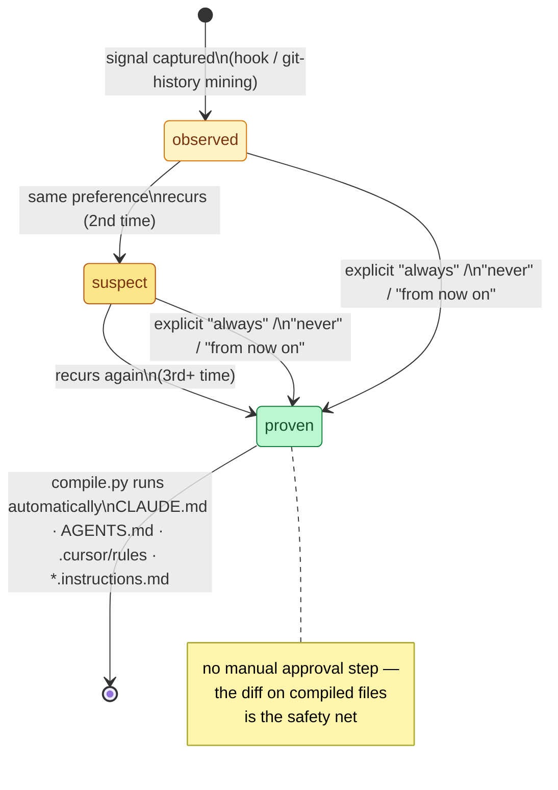

# patternity

Learns coding patterns from how you actually work — corrections, repeated
commit fixes, confirmations — and turns them into agent instructions,
automatically, instead of waiting for you to type them out explicitly every
time.

Works alongside Claude Code, Cursor, and GitHub Copilot. It does not replace
your existing CLAUDE.md / `.cursor/rules` / Copilot instructions — it feeds
them.

## Why

Most agent-instruction workflows are explicit: you notice a recurring
correction, and *you* write it into CLAUDE.md yourself. That's tedious, and
most of the signal (what you just corrected, what you just confirmed) gets
thrown away the moment the session ends. patternity captures that signal,
tracks how often it recurs, and once it's recurred enough to be trustworthy,
reflects it into every tool's instructions on its own.

## How it works



1. **Capture** — one shared hook script (`hooks/capture.py`) appends raw
   session signal to `.patternity/signal.jsonl` in the project you're working
   in, wired into whichever host you use: Claude Code's `Stop` hook (full
   user/assistant exchange via the transcript), Cursor's `beforeSubmitPrompt`
   hook (`.cursor/hooks.json`), or Copilot's `userPromptSubmitted` hook
   (`.github/hooks/patternity-capture.json`). All three write the same
   record shape, just tagged with a different `source`.
   `scripts/mine_git_history.py` adds a second, tool-independent source by
   mining commit messages/diffs. Cursor and Copilot hook config files ship
   with a `<path-to-patternity-clone>` placeholder since neither host has a
   Claude-Code-style plugin-root variable — fill in where you cloned this
   repo, or copy `hooks/capture.py` directly into the target project.
2. **Distill** — the `patternity` skill (`skills/patternity/SKILL.md`) reads
   `.patternity/signal.jsonl` and matches it against your personal pattern
   store at `${PATTERNITY_HOME:-~/.patternity}/patterns/` (outside any repo's
   git history — this is about you, not one project). Matching signal bumps
   a pattern's `occurrences`; new signal creates one at `state: observed`.
3. **Promote** — patterns climb `observed` (1) → `suspect` (2) → `proven`
   (3+) purely by recurrence. An explicit standing statement ("always...",
   "never...") skips straight to `proven` — it isn't an inference that needs
   corroborating. There's no manual approval step; the safety net is that
   every promotion lands as a visible, revertible git diff on the *compiled*
   files, not a pre-compile review queue.
4. **Compile** — the instant a pattern reaches `proven`, the skill runs
   `scripts/compile.py`, which renders every proven pattern into each tool's
   native format for the current project: `AGENTS.md`, `CLAUDE.md`,
   `.cursor/rules/patternity-learned.mdc`,
   `.github/instructions/patternity-learned.instructions.md`. Deterministic
   templating, no AI, idempotent (re-running just replaces the marked
   section) — so instructions/skills/agents stay dynamically in sync with
   what's actually been learned, instead of stale until someone remembers to
   run a script.

## The walking doc

`${PATTERNITY_HOME:-~/.patternity}/patterns/WALKING_DOC.md` is the running
index — one line per pattern, its state, and occurrence count — regenerated
every time the skill touches a pattern. See `patterns/_SCHEMA.md` for the
full frontmatter and the state ladder.

## Fine-grained scoping

The store is global, but a pattern doesn't have to apply everywhere:
`applies_to.project` scopes a pattern to the repo(s) it's actually been seen
in, and only widens to `"*"` once it's shown up across more than one
project. `applies_to.tool`/`glob` scope by host and file pattern the same
way.

## Overrides

A pattern can target and suppress a rule from another plugin/instruction
file that's annoying you, instead of only adding new rules. Set
`type: override` and `target` to the literal line/snippet you want gone.
The compiler removes that exact text from the file it appears in once the
override reaches `proven`; if the text isn't found verbatim (the source
file changed), it's flagged under a `## Overrides (needs manual check)`
section instead of silently failing. Copilot in particular resolves
conflicting instructions non-deterministically, so removing the offending
text directly is the only reliable way to suppress it there.

## Quickstart

```bash
# in the project you want patternity to learn from
uv run /path/to/patternity/scripts/mine_git_history.py
# ... use Claude Code/Cursor/Copilot for a while; hooks log signal automatically ...

# ask your agent to run the patternity skill, e.g.:
#   /patternity-distill
# proven patterns compile automatically; check `git diff` in your project
```

## Scope of v0

- Patterns are personal to the user (global store, outside any repo's git
  history) — not tied to one project. Compiled *output* is still per-project
  (CLAUDE.md etc. live in each repo), and `applies_to.project` keeps
  single-project observations from leaking everywhere by default.
- Capture sources: Claude Code `Stop` hook, Cursor `beforeSubmitPrompt` hook,
  Copilot `userPromptSubmitted` hook, and git history mining.
- Adapters cover Claude Code, Cursor, and Copilot. Adding another tool means
  adding one render function in `scripts/compile.py`.

## Repo layout

- `skills/patternity/SKILL.md` — canonical distillation/promotion logic
- `commands/` — `/patternity-distill`, `/patternity-compile` slash commands
- `hooks/` — shared capture hook wired into Claude Code, Cursor, and Copilot
- `scripts/` — `mine_git_history.py`, `compile.py` (plain `uv run` scripts, no project/deps needed)
- `patterns/` — schema doc + reference example (the real store is `${PATTERNITY_HOME:-~/.patternity}/patterns/`)
- `.cursor/rules/`, `.github/`, `.cursor/hooks.json` — static pointers so Cursor/Copilot know patternity exists, plus where the compiled learned-pattern files land
