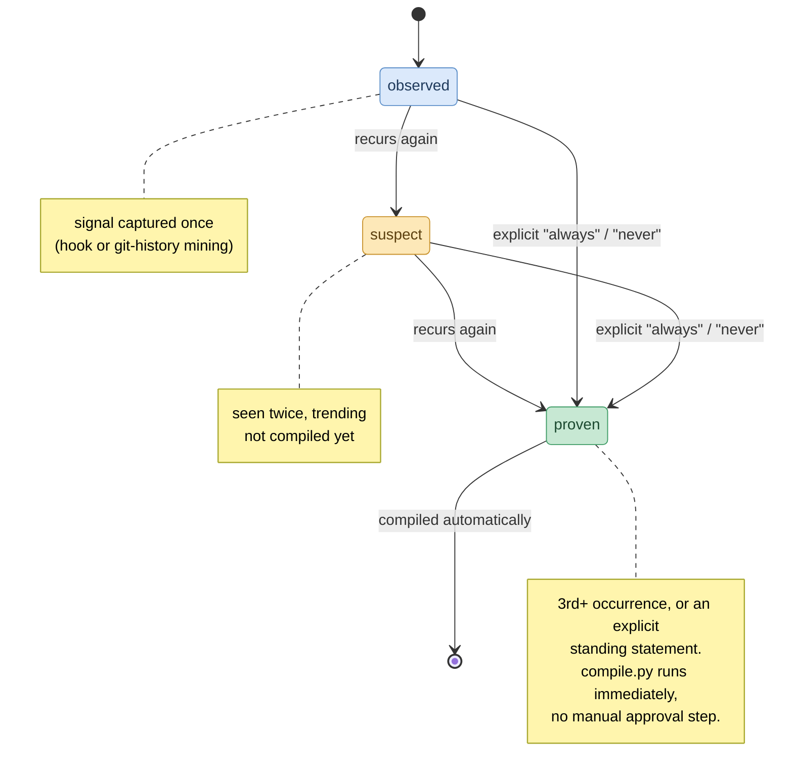

# patternity

Learns coding patterns from how you actually work — corrections, repeated
commit fixes, confirmations — and turns them into agent instructions,
automatically, instead of waiting for you to type them out explicitly every
time.

Works alongside Claude Code, Cursor, and GitHub Copilot. It does not replace
your existing CLAUDE.md / `.cursor/rules` / Copilot instructions — it feeds
them.

## Why

Most agent-instruction workflows are explicit: you notice a recurring
correction, and *you* write it into CLAUDE.md yourself. That's tedious, and
most of the signal (what you just corrected, what you just confirmed) gets
thrown away the moment the session ends. patternity captures that signal,
tracks how often it recurs, and once it's recurred enough to be trustworthy,
reflects it into every tool's instructions on its own.

## How it works



1. **Capture** — one shared hook script (`hooks/capture.py`) appends raw
   session signal to `.patternity/signal.jsonl` in the project you're working
   in, wired into whichever host you use: Claude Code's `Stop` hook (full
   user/assistant exchange via the transcript), Cursor's `beforeSubmitPrompt`
   hook (`.cursor/hooks.json`), or Copilot's `userPromptSubmitted` hook
   (`.github/hooks/patternity-capture.json`). All three write the same
   record shape, just tagged with a different `source`.
   `scripts/mine_git_history.py` adds a second, tool-independent source by
   mining commit messages/diffs. Cursor and Copilot hook config files ship
   with a `<path-to-patternity-clone>` placeholder since neither host has a
   Claude-Code-style plugin-root variable — fill in where you cloned this
   repo, or copy `hooks/capture.py` directly into the target project.
2. **Distill** — the `patternity` skill (`skills/patternity/SKILL.md`) reads
   `.patternity/signal.jsonl` and matches it against your personal pattern
   store at `${PATTERNITY_HOME:-~/.patternity}/patterns/` (outside any repo's
   git history — this is about you, not one project). Matching signal bumps
   a pattern's `occurrences`; new signal creates one at `state: observed`.
3. **Promote** — patterns climb `observed` (1) → `suspect` (2) → `proven`
   (3+) purely by recurrence. An explicit standing statement ("always...",
   "never...") skips straight to `proven` — it isn't an inference that needs
   corroborating. There's no manual approval step; the safety net is that
   every promotion lands as a visible, revertible git diff on the *compiled*
   files, not a pre-compile review queue.
4. **Compile** — the instant a pattern reaches `proven`, the skill runs
   `scripts/compile.py`, which renders every proven pattern into each tool's
   native format for the current project: `AGENTS.md`, `CLAUDE.md`,
   `.cursor/rules/patternity-learned.mdc`,
   `.github/instructions/patternity-learned.instructions.md`. Deterministic
   templating, no AI, idempotent (re-running just replaces the marked
   section) — so instructions/skills/agents stay dynamically in sync with
   what's actually been learned, instead of stale until someone remembers to
   run a script.

## The walking doc

`${PATTERNITY_HOME:-~/.patternity}/patterns/WALKING_DOC.md` is the running
index — one line per pattern, its state, and occurrence count — regenerated
every time the skill touches a pattern. See `patterns/_SCHEMA.md` for the
full frontmatter and the state ladder.

## Backing up your pattern store

`${PATTERNITY_HOME:-~/.patternity}` is treated like dotfiles: its own local
git repo, so every promotion is a revertible commit, but nothing is ever
pushed automatically. **No setup needed** — the store self-initializes
(directory + `git init`) the first time any tool writes to it. (`scripts/init_store.sh`
still exists if you want to create it deliberately, but you don't have to
run it.)

The `patternity` skill commits there itself after every distill run
(`git -C ~/.patternity add -A && git commit -m "..."`). To back it up or
sync across machines, add a remote whenever you want — e.g. a private
personal repo, kept separate from any project's code:

```bash
gh repo create <you>/patterns --private --source ~/.patternity --remote origin --push
```

## Visualizing the store

Every `compile.py` run also regenerates
`${PATTERNITY_HOME:-~/.patternity}/patterns/index.html` — a Kanban-style
board (Noticed | Recurring | Adopted — display labels only, the underlying
`state` values are still `observed`/`suspect`/`proven`) of every pattern in
the store, at every state, across every project. It's a single
self-contained file with the data embedded inline (no server, no
fetch/CORS issue — just open it), searchable, and paginated per column so
it doesn't turn into a wall of cards:

```bash
open ~/.patternity/patterns/index.html   # macOS; xdg-open on Linux
```

`index.json` next to it is the same data in plain structured form, for
anything else you want to build on top (a CLI summary, a different view).
The board is dark-only (no light theme), with near-square corners. Cards all
share one neutral elevated surface — state is carried by a crisp accent (a
glowing left bar, matching progress dots, and a tinted cluster chip), not a
full-card wash, since low-opacity tints on a near-black surface read muddy.
The accents run slate (observed) → amber (suspect) → green (proven), a
progression from "barely sure" to "confident". `type: override` patterns get
a small solid badge in a fourth reserved accent (violet), so it's never
confused for a state — the app's four-wave logo is those same four accent
colors. Occurrence count shows as three dots filled up to the pattern's
count. Clicking a card (or Enter/Space when focused) opens a **bottom
drawer** with the full body text, not just the truncated first line.

The logo, title, headings, card/drawer titles, and cluster chips use Caveat
(a handwriting webfont) as a flourish; everything else read as data —
body/"why" text, state and scope chips, occurrence counts — stays in Ubuntu,
a plain, legible sans. Both load from Google Fonts with a system-font
fallback if offline.

### Accept / reject

Both `state` and `decision` live in the pattern's frontmatter in the store —
nothing about a pattern is tracked only in the browser. `state` is the
automatic occurrence-driven ladder; `decision` is your manual override.

The board's hover buttons (✓ / ✕ on each card, or the buttons in the drawer)
let you **accept** a pattern (pins it to Adopted / compiled regardless of
count) or **reject** it (drops it to the collapsed "Rejected" tray;
tombstoned, never compiled, and the skill won't re-propose it). Because the
board is a static `file://` page it can't write the store directly, so your
clicks stage a set of pending decisions and a bar appears with the exact
command to persist them:

```bash
uv run <patternity-repo>/scripts/decide.py accept:uv-pref reject:tabs-not-spaces
# then re-run compile.py to reflect it (or just ask your agent — the
# patternity skill sets the same `decision` field)
```

`decide.py` writes the `decision` field into each pattern file in the store;
the next `compile.py` honors it (`is_effective_proven`). Reopen a rejected
card and clear it (`clear:name`) to hand it back to the automatic ladder.

If `${PATTERNITY_HOME:-~/.patternity}/patterns/PROFILE.md` exists, it's
rendered as a summary panel above the board — the skill's synthesis of
proven patterns grouped by `cluster` (tooling, code-style, workflow, ...),
e.g. "you default to uv over pip/venv, stated across multiple projects".
That's the "who is this user" digest; the board underneath stays the
detailed ledger.

## Tool surface (`patternity.py`)

An agent or skill can query and edit the store on the fly through one CLI,
called via Bash — no MCP server, no daemon, works identically across Claude
Code / Cursor / Copilot:

```bash
uv run scripts/patternity.py search "testing style"        # BM25, relevance-ranked
uv run scripts/patternity.py search "TODO|FIXME" --regex    # structural / exact
uv run scripts/patternity.py get uv-pref --json
uv run scripts/patternity.py list --state proven --json
uv run scripts/patternity.py add lint-on-save --cluster workflow --body "…"
uv run scripts/patternity.py bump uv-pref                    # +1 occurrence, re-derive state
uv run scripts/patternity.py set uv-pref decision accepted   # (--clear to remove)
uv run scripts/patternity.py dashboard                       # regenerate + open the board
```

**The file format is the API; this CLI is sugar.** The store is plain
markdown, so the fallback isn't something to build — if Python isn't
installed, an agent just greps and edits the files directly and gets the
same result. `patternity.py` exists to keep frontmatter valid and the
occurrence ladder consistent, and to give relevance-ranked search (BM25)
that raw grep can't. Search is computed on demand with no index or
dependency — fine for a personal store; a cached index only matters if it
ever grows into the thousands.

## Fine-grained scoping

The store is global, but a pattern doesn't have to apply everywhere:
`applies_to.project` scopes a pattern to the repo(s) it's actually been seen
in, and only widens to `"*"` once it's shown up across more than one
project. `applies_to.tool`/`glob` scope by host and file pattern the same
way.

## Overrides

A pattern can target and suppress a rule from another plugin/instruction
file that's annoying you, instead of only adding new rules. Set
`type: override` and `target` to the literal line/snippet you want gone.
The compiler removes that exact text from the file it appears in once the
override reaches `proven`; if the text isn't found verbatim (the source
file changed), it's flagged under a `## Overrides (needs manual check)`
section instead of silently failing. Copilot in particular resolves
conflicting instructions non-deterministically, so removing the offending
text directly is the only reliable way to suppress it there.

## Install

Clone this repo once (`git clone https://github.com/domudev/patternity`),
then wire it into whichever host(s) you use, per project:

**Claude Code** — real plugin install, no file copying needed:
```
/plugin marketplace add domudev/patternity
/plugin install patternity@patternity
```
This repo is private, so `/plugin marketplace add` needs GitHub access to
your account — if it can't fetch the marketplace, flip the repo to public
or fall back to referencing `skills/patternity/SKILL.md` and
`hooks/capture-hooks.json` directly from your clone.

**Cursor** and **GitHub Copilot** don't have an install command — their
hooks are just files in the target repo, so `scripts/install.sh` copies and
path-fills them for you:
```bash
# from your patternity clone
scripts/install.sh /path/to/target-project        # both Cursor + Copilot
scripts/install.sh /path/to/target-project cursor  # just one
scripts/install.sh /path/to/target-project copilot
```
It skips (and prints instead) any file that already exists in the target,
so it won't clobber hooks/instructions you've already customized.

## Quickstart

```bash
# in the project you want patternity to learn from
uv run /path/to/patternity/scripts/mine_git_history.py
# ... use Claude Code/Cursor/Copilot for a while; hooks log signal automatically ...

# ask your agent to run the patternity skill, e.g.:
#   /patternity        (or just "distill my patterns")
# proven patterns compile automatically; check `git diff` in your project
```

## Scope of v0

- Patterns are personal to the user (global store, outside any repo's git
  history) — not tied to one project. Compiled *output* is still per-project
  (CLAUDE.md etc. live in each repo), and `applies_to.project` keeps
  single-project observations from leaking everywhere by default.
- Capture sources: Claude Code `Stop` hook, Cursor `beforeSubmitPrompt` hook,
  Copilot `userPromptSubmitted` hook, and git history mining.
- Adapters cover Claude Code, Cursor, and Copilot. Adding another tool means
  adding one render function in `scripts/compile.py`.

## Repo layout

- `skills/patternity/SKILL.md` — canonical distillation/promotion logic
- `commands/` — `/patternity:compile`, `/patternity:dashboard` slash commands (distillation is the `patternity` skill itself, invoked as `/patternity` or auto-triggered)
- `hooks/` — shared capture hook wired into Claude Code, Cursor, and Copilot
- `scripts/` — `patternity.py` (agent-facing search/read/write/dashboard CLI), `compile.py`, `mine_git_history.py`, `decide.py` (apply accept/reject decisions), shared `_lib.py` parser (plain `uv run` scripts, no project/deps needed), plus `install.sh` (wires Cursor/Copilot into a target project) and `init_store.sh` (git-inits the personal pattern store)
- `patterns/` — schema doc + reference example (the real store is `${PATTERNITY_HOME:-~/.patternity}/patterns/`)
- `viz/template.html` — the visualization `compile.py` fills in and writes to the store as `index.html`
- `.claude-plugin/` — `plugin.json` + `marketplace.json` so this repo installs directly via `/plugin marketplace add domudev/patternity`
- `.cursor/rules/`, `.github/`, `.cursor/hooks.json` — static pointers so Cursor/Copilot know patternity exists, plus where the compiled learned-pattern files land
