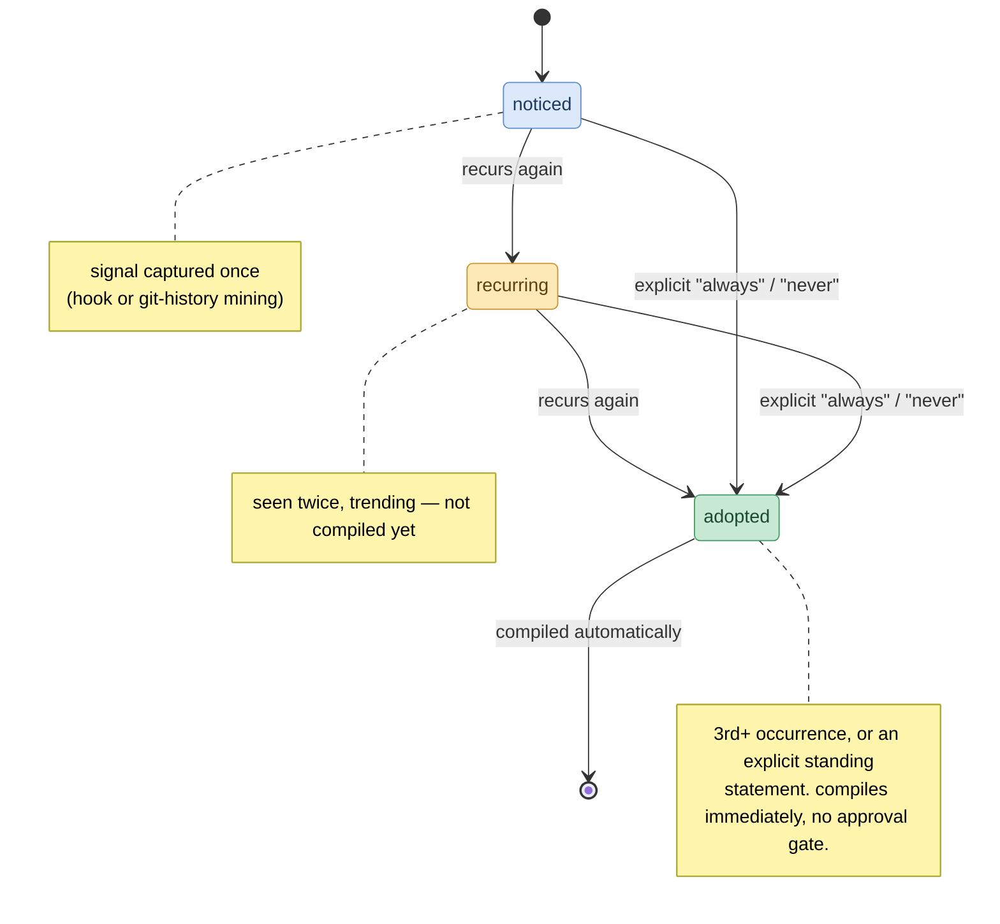

# How it works

Four steps: **capture → distill → promote → compile.** It runs off signal
that accumulates as you work — you don't do anything special.

## 1. Capture

One shared hook (`hooks/capture.py`) appends raw session signal to
`.patternity/signal.jsonl` in the project you're working in, wired into
whichever host you use:

- **Claude Code** — the `Stop` hook (full user/assistant exchange from the transcript)
- **Cursor** — the `beforeSubmitPrompt` hook (`.cursor/hooks.json`)
- **Copilot** — the `userPromptSubmitted` hook (`.github/hooks/patternity-capture.json`)

All three write the same record shape, tagged with a different `source`.
Slash-command, skill, and tool-output turns are filtered out (they're not
real signal). `scripts/mine_git_history.py` adds a second, tool-independent
source by mining commit messages/diffs.

## 2. Distill

The `patternity` skill (`skills/patternity/SKILL.md`) reads
`.patternity/signal.jsonl` and matches it against your pattern store. Genuine
corrections/confirmations become pattern files; matching signal bumps an
existing pattern's `occurrences`.

## 3. Promote

Patterns climb the ladder purely by recurrence:

| occurrences | state | compiled? |
|---|---|---|
| 1 | `noticed` | no |
| 2 | `recurring` | no |
| 3+ | `adopted` | yes, automatically |

An explicit standing statement ("always…", "never…") skips straight to
`adopted` — it isn't an inference that needs corroborating. There's no manual
approval gate; the safety net is that every promotion lands as a visible,
revertible git diff on the compiled files.

## 4. Compile

The instant a pattern reaches `adopted`, `scripts/compile.py` writes the
rules to modular per-cluster files (`patternity/<cluster>.md`, the single
source), then makes each tool config **reference** them rather than inlining:
`CLAUDE.md` gets `@patternity/<cluster>.md` imports; `AGENTS.md` and the
Cursor/Copilot rule files get links. Your curated files stay a short pointer
block, not a growing dump. Deterministic, no AI, idempotent.

## The structured index

`${PATTERNITY_HOME:-~/.patternity}/patterns/index.json` is the machine-readable
index of every pattern (state, cluster, decision, occurrences, scope, …),
regenerated by `compile.py`/`dashboard`. `index.html` is the human view of the
same data; the per-pattern `*.md` files are the source of truth.
